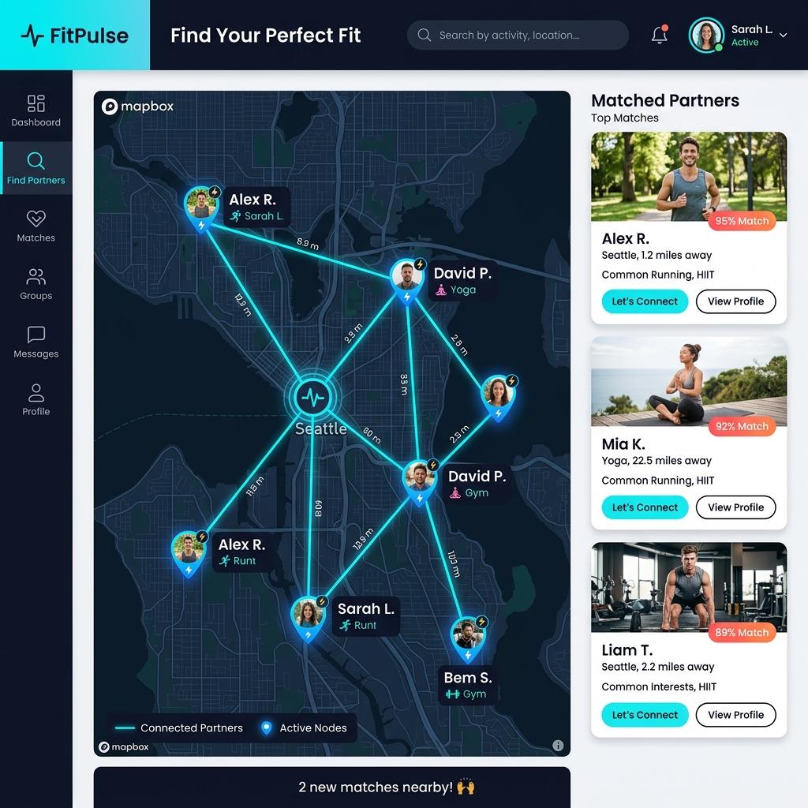

# 🏋️ Fitness Partner Matcher (O(1) Geohash Optimized)



A highly efficient, single-window React application that demonstrates a scalable algorithm for matching users with compatible fitness partners based on **Age**, **Gender**, and **Geographical Location**.

## 🚀 The Algorithm Explained

Matching users based on location usually requires running complex mathematical formulas (like the Haversine formula) across millions of users, which causes extreme performance bottlenecks (an `O(N)` time complexity problem). 

This mini-project solves that problem by implementing **Geohashing**, an industry-standard spatial indexing technique used by platforms like Tinder and Uber.

### Step-by-Step Logic:

1. **Pre-computation (The Grid)**: 
   When the application loads, it encodes every user's GPS coordinates into a short string called a **Geohash** (e.g., `"ttnf"` for Central Delhi). It groups users sharing the same Geohash into buckets within a Hash Map.
   
2. **O(1) Lightning Search**: 
   When a user clicks search, the app calculates *their* current Geohash and the 8 surrounding grid squares. It performs an instant `O(1)` Hash Map lookup to pull exactly those 9 buckets. This instantly eliminates 99.9% of the database without running any heavy math.

3. **Precision Filtering (Haversine)**: 
   Because grid squares are square, and a search radius is a circle, we take the small subset of users found in Step 2 and run the **Haversine Formula**. This calculates the exact distance over the earth's curvature to ensure they are strictly within the user's preferred max distance.

4. **Hard Filters & Sorting**: 
   Finally, it filters out anyone who doesn't meet the strict Age and Gender requirements, and sorts the remaining users so the closest partners appear at the very top.

## 🛠️ Tech Stack
* **Frontend**: React.js (Vite)
* **Spatial Indexing**: `ngeohash` (Geohash encoding/decoding)
* **Architecture**: Single-Component pure frontend application (No backend required for demo).

## 💻 How to Run Locally

1. Clone or download this repository.
2. Open your terminal and navigate to the project folder:
   ```bash
   cd fitness-matcher
   ```
3. Install the dependencies:
   ```bash
   npm install
   ```
4. Start the development server:
   ```bash
   npm run dev
   ```
5. Open your browser and go to `http://localhost:5173/` to see the algorithm in action!
